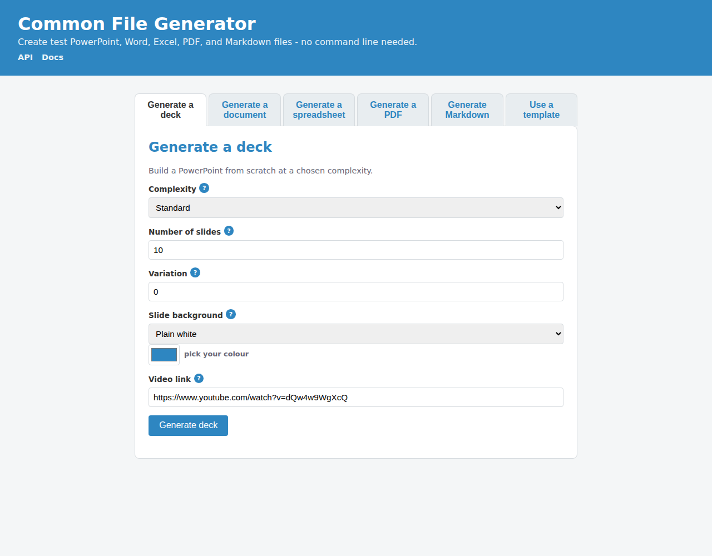
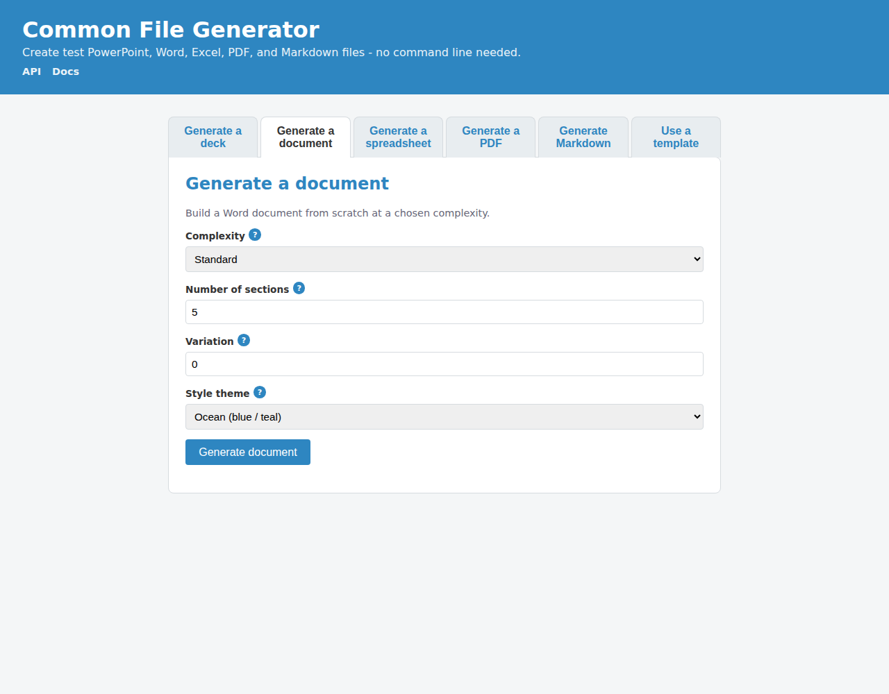
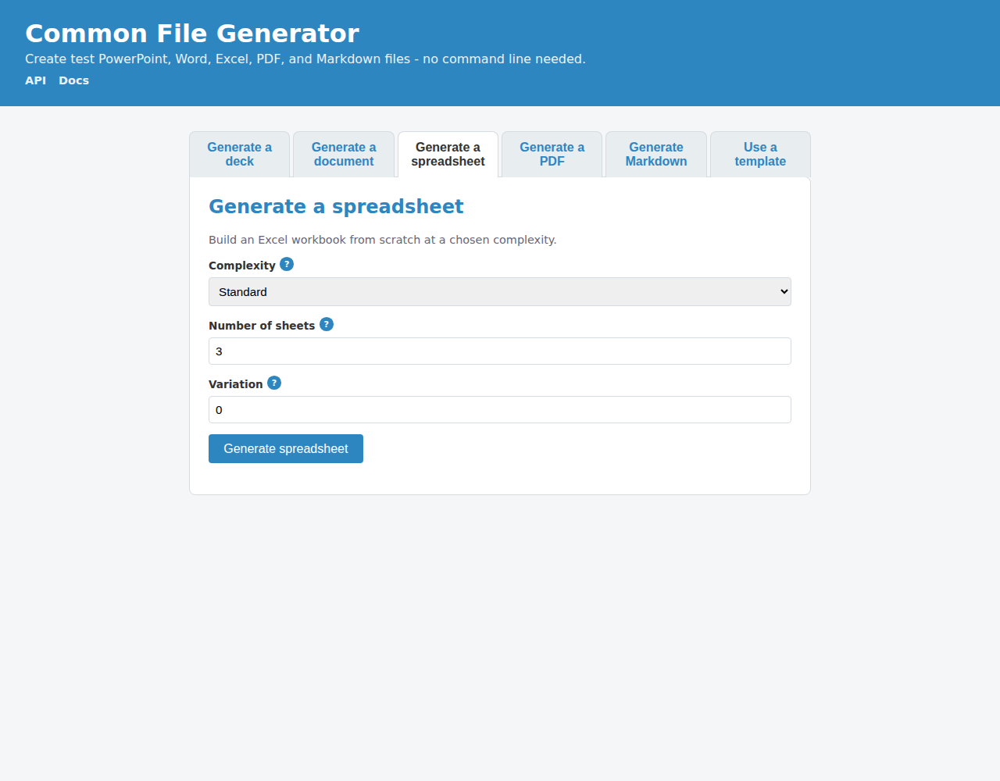
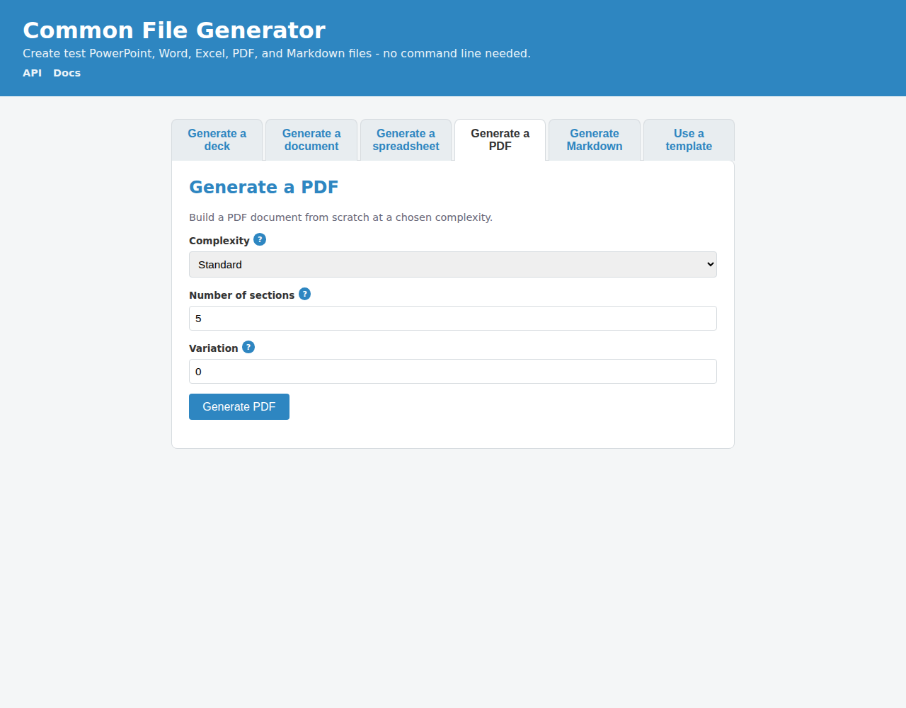
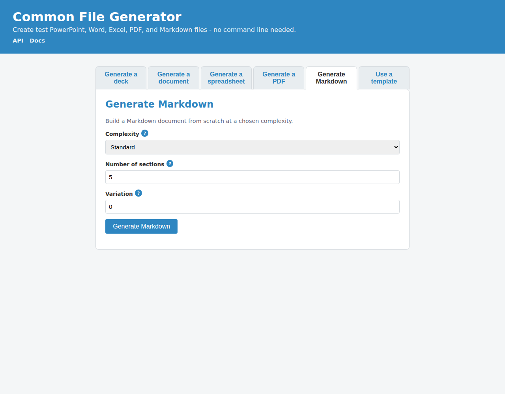
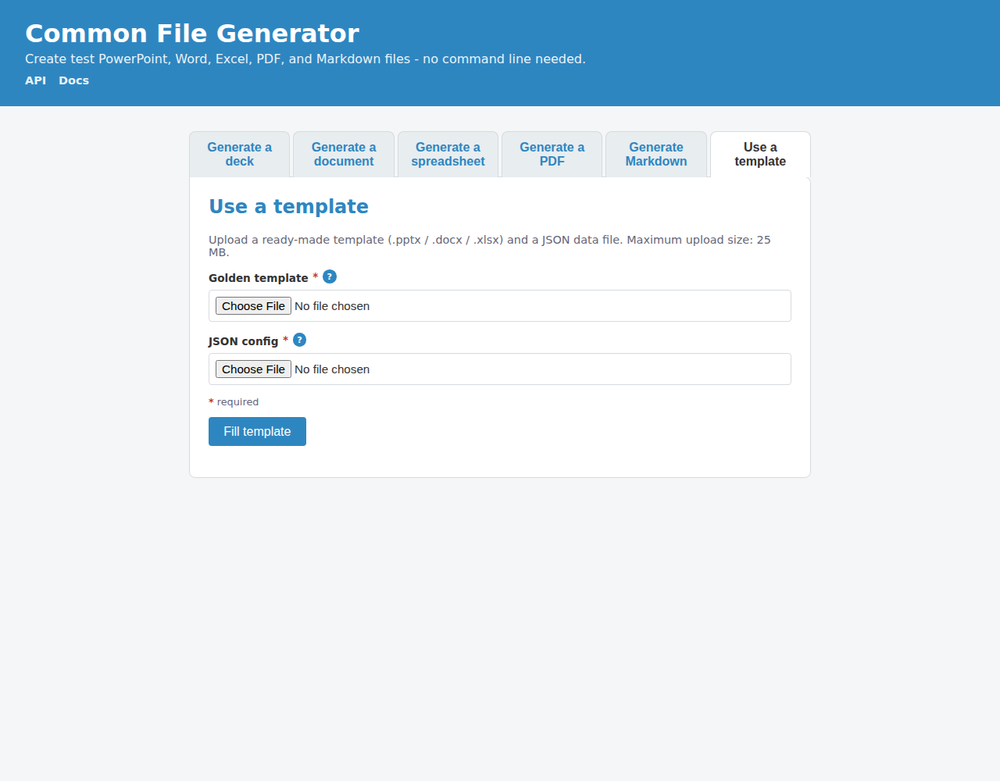
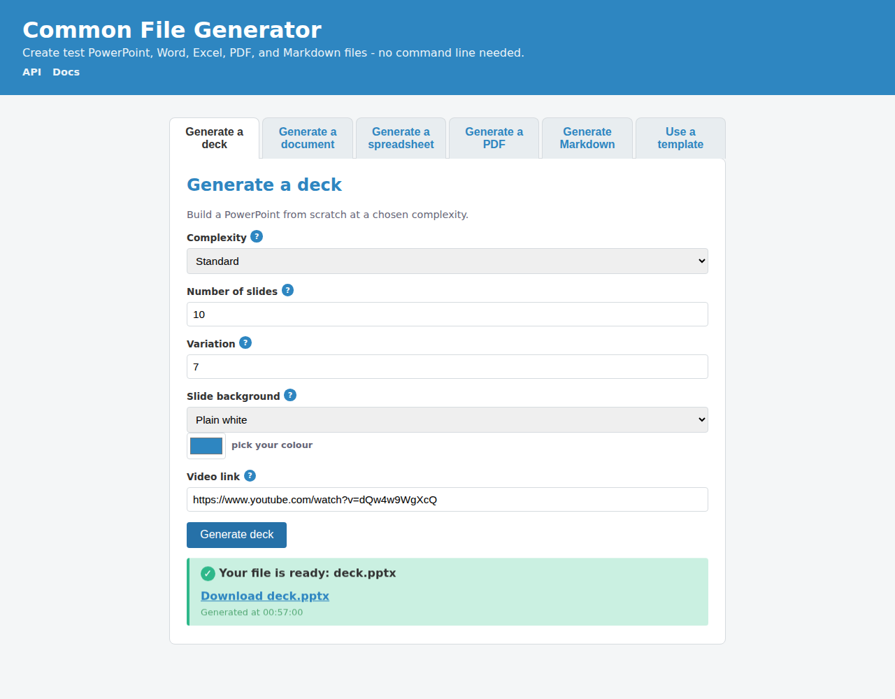

# Web UI walkthrough

The web UI lets anyone create test files without touching the command line. Run
it with `make serve` (or `uv run gen-ui`) and open
<http://127.0.0.1:18990>. The screenshots below are captured automatically from
the live UI - see [How it works](how-it-works.md) for the capture pipeline.

## The landing page

A single page with a strip of tabs across the top - one per file type, plus
**Use a template** for the Golden-file flow. The header carries **API** and
**Docs** links (the API link opens the live Swagger reference at `/docs`).

## Generate a deck

Build a PowerPoint from scratch. Pick a **complexity** (how busy each slide is),
the **number of slides**, a **variation** number (same number → same deck), and a
slide **background**. Choosing *Custom colour* reveals a colour picker.

## Generate a document

Build a Word `.docx`. Choose complexity, the number of **sections**, a variation
number, and a **theme**.

## Generate a spreadsheet

Build an Excel `.xlsx` with a chosen number of **sheets** at a chosen complexity.

## Generate a PDF

Build a PDF with a chosen number of **sections** at a chosen complexity.

## Generate Markdown

Build a Markdown document with a chosen number of **sections** at a chosen
complexity.

## Use a template (fill mode)

Upload a ready-made **Golden template** (`.pptx` / `.docx` / `.xlsx`) and a
**JSON data file**; the tool injects your values into the template without
redrawing the layout. See [Preparing a Golden template](golden-file-guide.md)
and [The data file (JSON)](config-guide.md).

## The result

After generating, a result card appears with a **download link**. Generated
files are held briefly server-side and swept after an hour.

